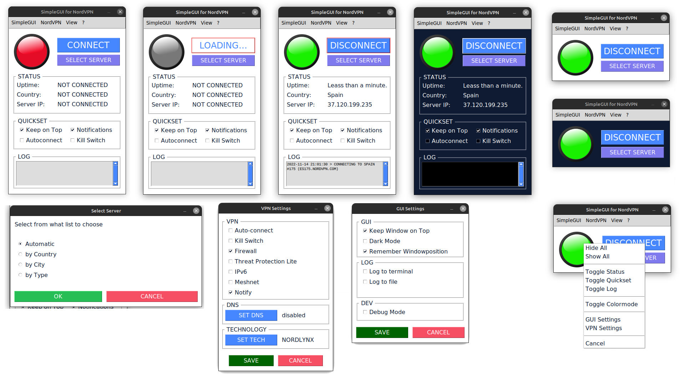

# A SimpleGUI for NordVPN on LINUX

NordVPN only provides a commandline tool to control the vpn on linux. 

This is a first basic prototype to control the nordvpn terminal-app via a GUI.

The GUI lets you control (most of) the actions and settings of the commandline
tool and gives you a visual status of your connection.

# *** Working alpha Version ***

You are very much invited to contribute on every level...
Also, feel free to use the code in any way you want.

# Status Icon

Red and Green Icon to show Connecton-Status

# Status Details (can be hidden from main view)

Shows Uptime, Country of Server and Server-IP

# Available Actions

Control the NordVPN commandline tool:
- Login
- Logout
- Connect
  - Automatic
  - by Country
  - by City
  - by Service
  - to last selected
- Disconnect
- View NordVPN Account-Status
- Reset Settings

# Available Settings:

Modify your VPN-Preferences:
- Autoconnect
- Kill Switch
- Firewall
- Threat Protection Lite
- IPv6
- Meshnet
- Notifications

# Quicksettings (can be hidden from main view)

Easily turn on and off basic settings
- Keep Window on Top
- Notifications
- Autoconnect
- Kill Switch

# Minilog (can be hidden from main view)

Show recent logs in memory

# optional: Logging to file

All logging is turned off by default,
but you can turn it on under GUI Settings

# optional: Logging to terminal window

All logging is turned off by default,
but you can turn it on under GUI Settings

# YOU NEED THE NordVPN Commandline Tool ("VPNapp")

Download at: https://nordvpn.com/download/
(Tested with Version 3.13.2 and above)
